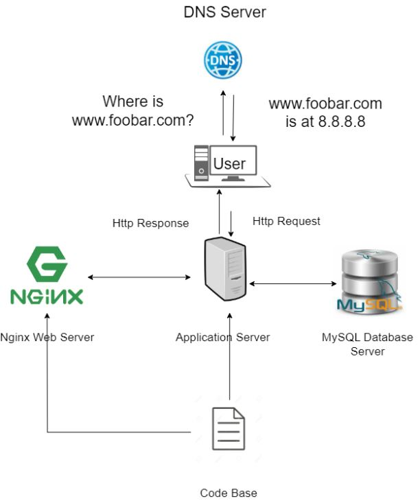

# Exploring Web Infrastructure Design: Concepts and Challenges

**Abstract:**
Web infrastructure design is crucial for ensuring reliable and efficient website performance. This paper delves into key concepts of web infrastructure and discusses the associated challenges. Specifically, we examine a single server setup hosting the website "www.foobar.com" and address its components, communication, and potential drawbacks.

## 1. Introduction:

In the realm of web development, robust infrastructure design is pivotal in delivering seamless user experiences. This paper focuses on dissecting the components and intricacies of a web infrastructure, shedding light on its various roles and potential pitfalls. To contextualize these discussions, we consider a hypothetical scenario where a single server hosts the website "www.foobar.com".

## 2. Key Concepts:

### 2.1 Server:

A server serves as the backbone of web infrastructure, providing resources and services to clients over a network. In our scenario, the server hosts the website and manages incoming requests from users.

### 2.2 Role of the Domain Name:

Domain names, like "www.foobar.com," offer human-readable addresses that ease navigation. They act as a bridge between users and servers, translating memorable names into numeric IP addresses.

### 2.3 DNS Record for "www" Subdomain:

For "www.foobar.com," the DNS record is an "A" record. This record associates the subdomain "www" with the server's IP address (8.8.8.8), allowing users to access the website via the familiar URL.

### 2.4 Role of the Web Server:

The web server (Nginx) processes HTTP requests from users' browsers. It serves static content and redirects dynamic requests to the application server.

### 2.5 Role of the Application Server:

The application server handles dynamic content generation and executes business logic. It communicates with the database to fetch and store data as needed for user interactions.

### 2.6 Role of the Database:

The database (MySQL) stores website data, including user accounts and content. The application server interacts with the database to ensure data integrity and retrieval.

### 2.7 Communication with User's Computer:

When a user accesses "www.foobar.com," the server communicates using the HTTP protocol. It responds with HTML content that the user's browser renders for display.

## 3. Challenges with the Infrastructure:

### 3.1 Single Point of Failure (SPOF):

Despite its functionalities, a single server infrastructure introduces a single point of failure. Any server downtime results in complete inaccessibility to the website.

### 3.2 Downtime During Maintenance:

Routine maintenance or updates, such as deploying new code, necessitate web server restarts. This downtime disrupts user access during the maintenance window.

### 3.3 Scalability Challenges:

Scalability is limited in this setup. As incoming traffic surges, the server may struggle to handle the load efficiently, leading to potential performance degradation.

## 4. Conclusion:

Understanding the intricacies of web infrastructure design is paramount in building resilient web systems. The explored single server setup highlights essential components and functions, along with challenges like SPOF, downtime, and scalability. Acknowledging these considerations is crucial in creating a user-centric and reliable web presence.

## References:
- [What Is a Server? - W3Schools](https://www.w3schools.com/whatis/whatis_server.asp)
- [What Is a Domain Name? - ICANN](https://www.icann.org/resources/pages/what-is-a-domain-name-2019-03-05-en)
- [Web Server Definition - Nginx](https://www.nginx.com/resources/glossary/web-server/)
