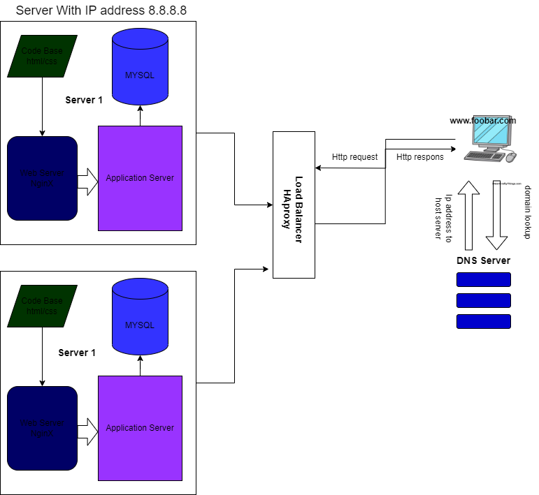

# Exploring Web Infrastructure Design: Concepts, Elements, and Challenges

**Abstract:**
This paper delves into the complexities of web infrastructure design by discussing its specific components and associated challenges. It addresses a hypothetical scenario involving a one-server setup for hosting the website "www.foobar.com." In addition to covering key concepts, this paper explores the rationale behind adding various elements, the distribution algorithm of the load balancer, database clustering, and potential issues that the infrastructure might face.

## 1. Introduction:

Web infrastructure design plays a pivotal role in delivering reliable and responsive web experiences. This paper builds on the foundational elements of a one-server setup for "www.foobar.com" and extends the analysis to encompass load balancing, database clustering, and the potential challenges inherent to this configuration.

## 2. Key Concepts:

In the context of the project's infrastructure, we explore several key concepts that form the foundation of web infrastructure design.

### 2.1 Server and Domain Name:

We revisit the role of the server and domain name. A server hosts the website, while the domain name acts as a human-readable address for user access.

### 2.2 Load Balancer:

To address scalability challenges, we introduce a load balancer to distribute incoming traffic across multiple servers. This ensures even resource utilization and enhances performance.

### 2.3 Distribution Algorithm:

The load balancer employs a Round Robin distribution algorithm. This algorithm directs each incoming request to the next available server in a cyclic manner, thereby evenly distributing the workload.

### 2.4 Active-Active vs. Active-Passive Setup:

The load balancer configuration enables an Active-Active setup. In this setup, multiple servers are actively handling requests simultaneously, ensuring optimal resource utilization. Active-Passive, on the other hand, involves standby servers that become active only when the primary servers fail.

### 2.5 Database Primary-Replica Cluster:

To enhance database performance and redundancy, we implement a Primary-Replica (Master-Slave) cluster. The Primary node handles write operations, while the Replica node replicates data from the Primary node and serves read requests.

### 2.6 Role of Primary and Replica Nodes:

The Primary node is responsible for processing write operations, maintaining data integrity, and ensuring consistency. The Replica node primarily handles read requests, relieving the Primary node from excessive read-related loads.

### 2.7 Communication Security:

We address security concerns by implementing HTTPS for secure data transmission between the server and user devices. Additionally, we introduce a firewall to safeguard against unauthorized access.

### 2.8 Monitoring:

To mitigate potential issues, we emphasize the importance of monitoring tools that track server health, traffic patterns, and resource utilization.

## 3. Challenges with the Infrastructure:

While our extended infrastructure design addresses several challenges, it still presents certain limitations.

### 3.1 Single Points of Failure (SPOF):

Despite load balancing, individual servers remain vulnerable to failure, potentially impacting user access.

### 3.2 Security Issues:

Omitting a firewall and HTTPS implementation introduces security vulnerabilities, potentially leading to data breaches and unauthorized access.

### 3.3 Lack of Monitoring:

The absence of monitoring tools hinders proactive identification of performance bottlenecks, security breaches, and other issues.

## 4. Conclusion:

In this paper, we have dissected the intricacies of web infrastructure design. By extending the one-server setup to incorporate load balancing, database clustering, and security measures, we aim to enhance reliability and performance. However, we acknowledge the importance of addressing challenges such as SPOF, security vulnerabilities, and monitoring deficiencies to build truly robust web systems.

## References:

1. W3Schools. "Introduction to Servers." [Online]. Available: https://www.w3schools.com/whatis/whatis_server.asp.
2. Cloudflare. "Understanding DNS Records." [Online]. Available: https://www.cloudflare.com/learning/dns/dns-records/dns-a-record/.
3. Nginx. "What Is a Web Server." [Online]. Available: https://www.nginx.com/resources/glossary/web-server/.
4. MySQL. "What Is a Database?" [Online]. Available: https://www.mysql.com/what-is-mysql/.
5. TechRepublic. "How HTTPS Works: What You Need to Know About Secure Sockets Layer." [Online]. Available: https://www.techrepublic.com/article/how-https-works-what-you-need-to-know-about-secure-sockets-layer/
