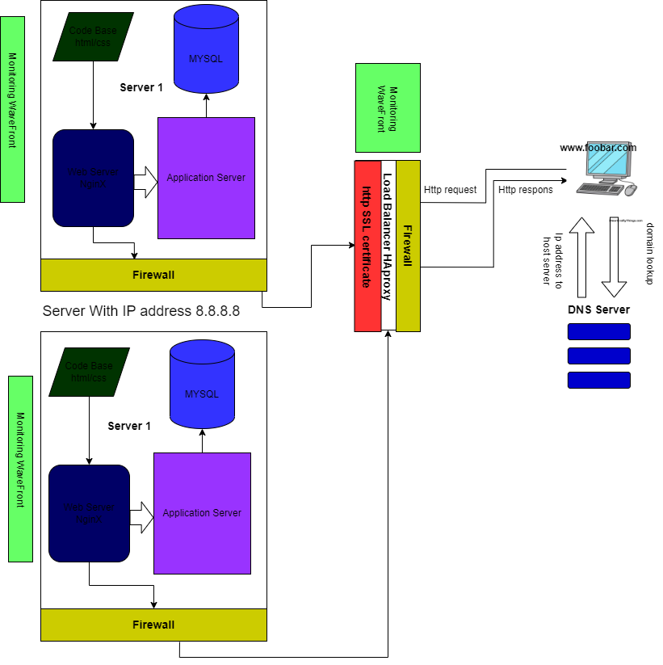

# Enhancing Web Infrastructure Design: Security, Encryption, and Monitoring

**Abstract:**
This paper delves into the intricate design aspects of a robust web infrastructure that ensures security, encrypted traffic, and proactive monitoring. We take the foundation of the single-server setup for "www.foobar.com" and expand it into a three-server configuration, incorporating firewalls, SSL certificates, and monitoring clients to create a resilient and secure environment.

## 1. Introduction:

As the backbone of modern digital experiences, web infrastructure design demands meticulous attention to security and performance. This paper extends the initial infrastructure to include firewalls, SSL certificates, and monitoring clients for an enhanced web presence.

## 2. Enhancing the Infrastructure:

### 2.1 Three-Server Setup:

Building upon the single-server setup, we introduce three servers to distribute workloads and enhance redundancy, ensuring higher availability and performance.

### 2.2 Adding Firewalls:

Firewalls are introduced to bolster security by monitoring and controlling incoming and outgoing network traffic. They act as barriers against potential threats and unauthorized access.

### 2.3 Implementing SSL Certificate:

We secure communication between users and servers by implementing an SSL certificate. This ensures that traffic between "www.foobar.com" and user devices is encrypted, safeguarding sensitive data.

### 2.4 Incorporating Monitoring Clients:

Monitoring clients, such as data collectors for Sumo Logic, are added to the infrastructure. These tools gather essential data for performance analysis, security monitoring, and issue detection.

## 3. Specifics of the Infrastructure:

### 3.1 The Role of Firewalls:

Firewalls are essential for network security. They scrutinize traffic, filter out malicious requests, and safeguard against unauthorized access, adding layers of defense to the infrastructure.

### 3.2 Importance of HTTPS:

Serving traffic over HTTPS ensures secure data transmission between users and the server. This encryption prevents eavesdropping, data tampering, and other security vulnerabilities.

### 3.3 Significance of Monitoring:

Monitoring is crucial for maintaining optimal performance and identifying potential issues before they escalate. It aids in identifying trends, understanding user behavior, and enhancing system resilience.

### 3.4 Data Collection by Monitoring Clients:

Monitoring clients collect data by analyzing logs, metrics, and events generated by various components. This data is then processed and presented to administrators for insights and decision-making.

### 3.5 Monitoring Web Server QPS:

To monitor the web server's Queries Per Second (QPS), administrators can set up monitoring tools to track incoming requests, resource utilization, and response times.

## 4. Challenges with the Infrastructure:

### 4.1 Termination of SSL at Load Balancer Level:

Terminating SSL at the load balancer level might expose decrypted data to potential security breaches if not handled carefully.

### 4.2 Single MySQL Server Accepting Writes:

Having only one MySQL server capable of accepting writes poses a single point of failure and performance bottlenecks.

### 4.3 Identical Server Components:

Uniform server components might lead to resource contention and performance issues as all servers share the same resources.

## 5. Conclusion:

In this paper, we have explored the evolution of a web infrastructure design from a single-server setup to a more robust and secure three-server configuration. By introducing firewalls, SSL certificates, and monitoring clients, we have fortified the infrastructure against potential threats and harnessed the power of proactive monitoring. However, we have also acknowledged the challenges inherent in SSL termination, MySQL write acceptance, and uniform server components, underlining the need for careful consideration in building resilient web systems.

## References:

1. Cloudflare. "Firewall." [Online]. Available: https://www.cloudflare.com/learning/security/threats/firewall/.
2. GlobalSign. "Why HTTPS is Essential for Every Website." [Online]. Available: https://www.globalsign.com/en/blog/why-https-is-essential-for-every-website.
3. Sumo Logic. "Collecting Data." [Online]. Available: https://www.sumologic.com/collect/.
4. Dynatrace. "Queries Per Second (QPS)." [Online]. Available: https://www.dynatrace.com/support/help/shortlink/qps.
