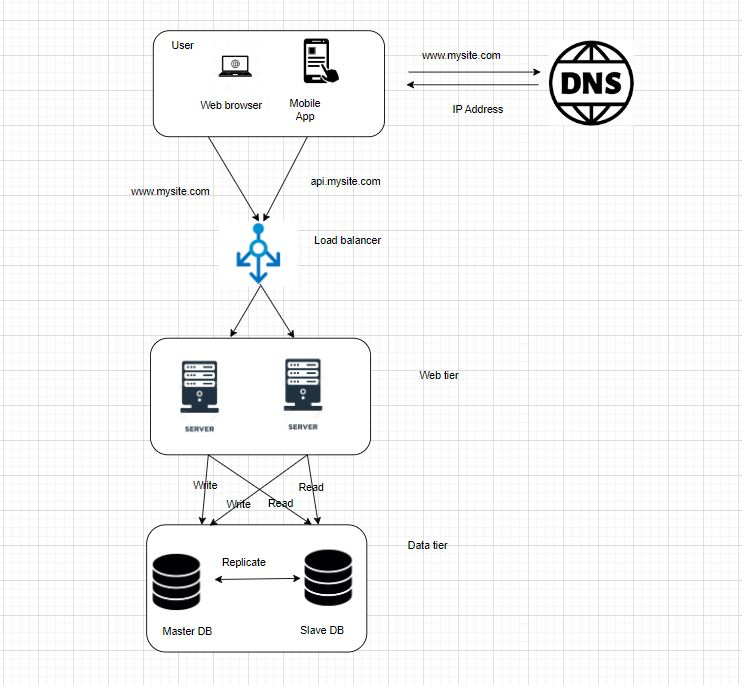

# Building a Scalable Web Infrastructure: Load Balancing and Component Separation

**Abstract:**
This technical paper delves into the architecture and implementation of a scalable web infrastructure. By incorporating load balancing and separating components, we aim to enhance performance, availability, and maintainability. This section discusses the role of load balancers, the separation of web servers, application servers, and database servers, as well as the benefits and challenges of this approach.

## 1. Introduction:

In the realm of modern web development, creating a robust and scalable infrastructure is paramount to providing users with reliable, responsive, and secure online experiences. This part explores the integration of load balancing and component separation in a web infrastructure, shedding light on the reasons for their inclusion, their specific roles, and the resulting advantages.

## 2. The Need for Scalability:

As web applications grow in popularity, the ability to scale resources becomes crucial. Scalability addresses the challenges of accommodating increasing traffic while ensuring consistent performance. In this context, we explore the integration of load balancing and the separation of components as key strategies to achieve scalability.

## 3. Load Balancing and its Role:

Load balancing is a mechanism that evenly distributes incoming traffic across multiple servers, ensuring efficient resource utilization and preventing server overload. It enhances availability and fault tolerance by directing users to healthy servers and automatically rerouting traffic in case of failures.

## 4. Separating Components:

### Web, Application, and Database Servers:

To enhance scalability and manageability, the web infrastructure is divided into distinct components:

#### Web Servers:

These servers are responsible for serving static content, processing HTTP requests, and handling user interactions. Separating them from the application server improves resource allocation and simplifies maintenance.

#### Application Servers:

Application servers handle dynamic content generation and execute business logic. They offload the web servers by processing dynamic requests and interacting with the database.

#### Database Servers:

Database servers store and manage data. Isolating the database from the application servers ensures efficient data management and performance optimization.

## 5. Implementation Steps:

To build this scalable infrastructure, several steps are taken:

### Load Balancer Cluster Setup:

Configure HAproxy as a load balancer cluster to distribute traffic across servers. Ensure synchronization and failover mechanisms.

### Web Server Setup:

Install Nginx on web servers, configure them to serve static content, and forward dynamic requests to application servers.

### Application Server Setup:

Install and configure application server software (e.g., Gunicorn) to process dynamic content and application logic.

### Database Server Setup:

Install and configure MySQL, ensuring data replication and failover mechanisms for data integrity and availability.

## 6. Benefits and Challenges:

**Benefits:**

- Scalability: Load balancing ensures even distribution of traffic, enabling seamless scalability as user demand grows.
- Availability: Load balancers enhance fault tolerance, directing users to healthy servers and reducing downtime.
- Performance: Separation of components optimizes resource allocation and allows for targeted performance optimization.
- Maintainability: Separating components simplifies maintenance, updates, and debugging, as each component can be managed independently.

**Challenges:**

- Complexity: Implementing load balancing and separating components introduces complexity that requires careful configuration and management.
- Consistency: Ensuring consistent data across database servers can be challenging due to replication delays in some cases.

## 7. Conclusion:

The implementation of load balancing and component separation is a pivotal step toward building a scalable web infrastructure. By distributing traffic, optimizing resource allocation, and isolating components, we create an environment capable of handling increasing user demand while maintaining high levels of performance and availability. Despite the challenges, the benefits of scalability, availability, and performance enhancement make this approach an essential strategy for modern web systems.

## References:

1. Cloudflare. "Introduction to Load Balancing." [Online]. Available: https://www.cloudflare.com/learning/load-balancing/what-is-load-balancing/.
2. Nginx. "Introduction to Nginx." [Online]. Available: https://www.nginx.com/resources/glossary/nginx/.
3. MySQL. "Introduction to MySQL." [Online]. Available: https://www.mysql.com/what-is-mysql/.
4. DigitalOcean. "How To Set Up Django with Postgres, Nginx, and Gunicorn on Ubuntu 18.04." [Online]. Available: https://www.digitalocean.com/community/tutorials/how-to-set-up-django-with-postgres-nginx-and-gunicorn-on-ubuntu-18-04.
